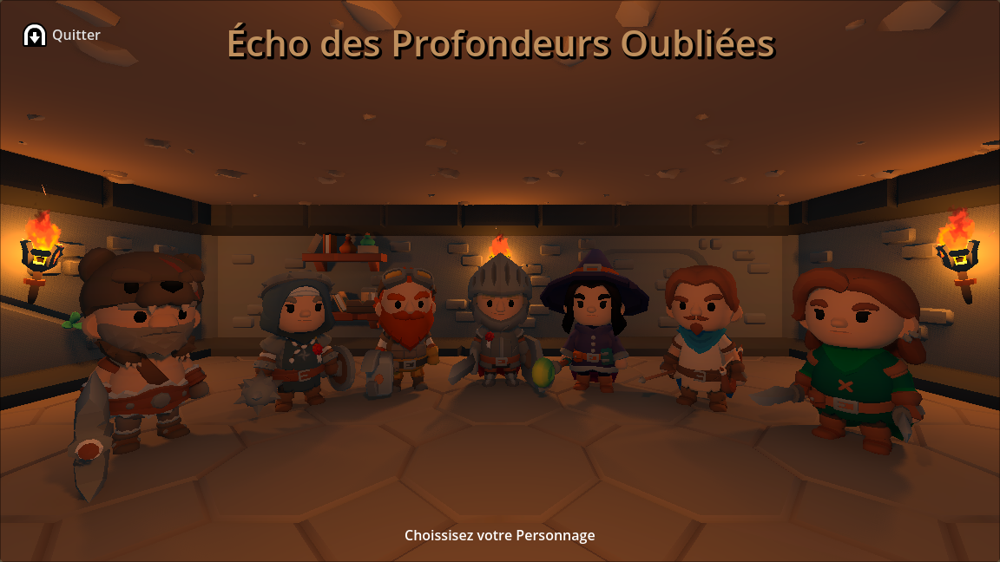
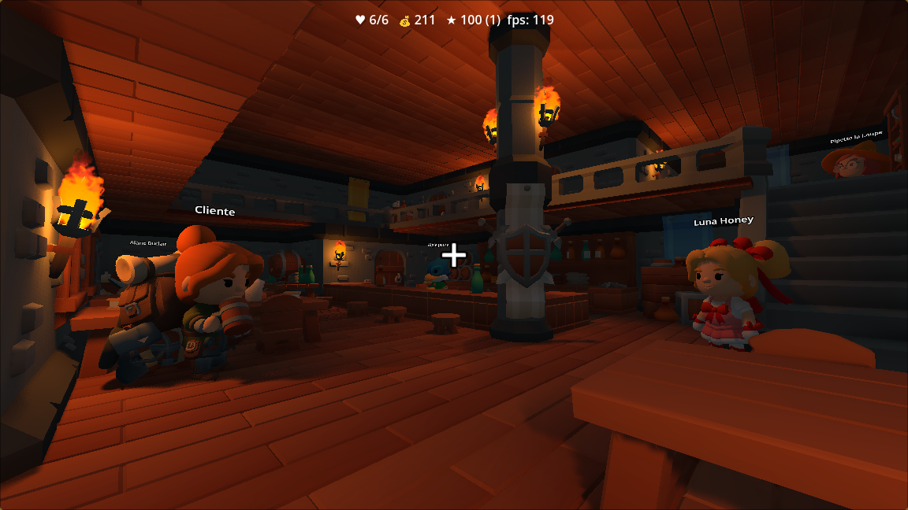
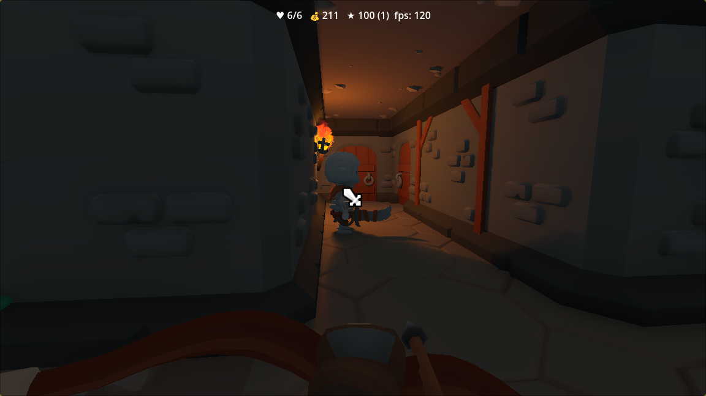
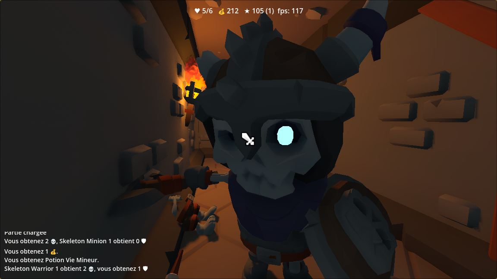
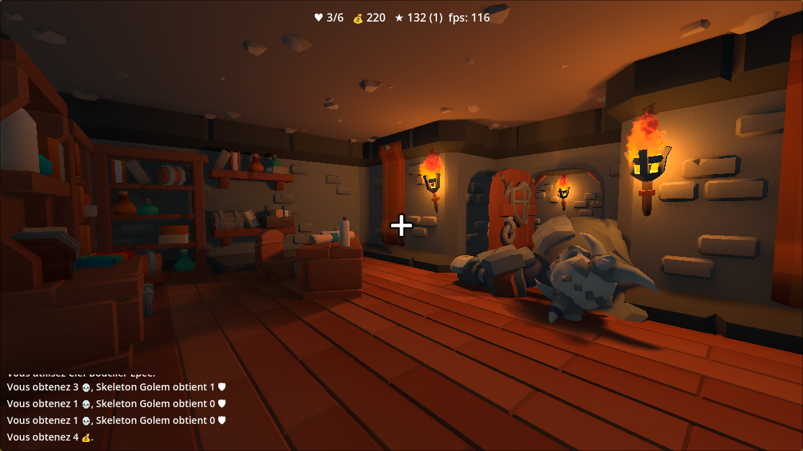
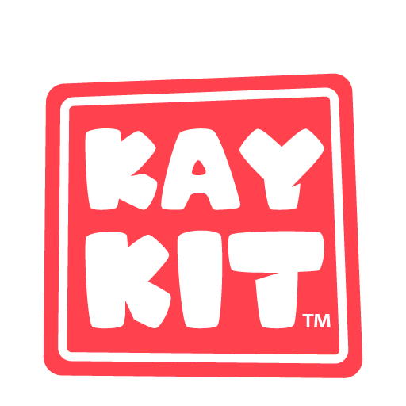

# Écho des Profondeurs oubliées

**Écho des Profondeurs oubliées** est un _Dungeon crawler_ qui s'inspire du jeu de société _Hero Quest_ et des jeu vidéo du style _Dungeon Master_ et _Ultima Underworld_. 

## Capture

## Asset

### 3D and characters
Je ne suis pas graphiste, les assets proviennent principalement de [Kaykit par kaylousberg](https://kaylousberg.itch.io/kaykit-complete). 

### VFX 
- https://binbun3d.itch.io/magic-projectiles-vfx

### UI 
- https://www.kenney.nl/

### Audio
- https://www.kenney.nl/
- https://opengameart.org/content/80-cc0-rpg-sfx
- https://opengameart.org/content/rpg-sound-pack
- https://opengameart.org/content/zombie-skeleton-monster-voice-effects
- https://opengameart.org/content/boom-pack-2
- https://opengameart.org/content/teleport-spell
- https://opengameart.org/content/new-thing-get
- https://opengameart.org/content/win-sound-1
- https://opengameart.org/content/30-cc0-sfx-loops

### Music
- https://opengameart.org/content/rpg-title-1
- https://opengameart.org/content/dungeon-themes
- https://opengameart.org/content/rpg-never-go-full-bard

# Carnet de Dev

## TODO
- remplacer le curseur d'hors porté
- ajouter une fenetre de statistique. 
- ajouter des options
  - definition ?
  - effet de flamme ?
- ajouter des options d'input
  - sensibilité souris
  - configuration des racourci
- combat
  - Ajouter un systeme d'aggro
- barre de state : lvl pas explicie, ni l'xp, et depalcer le FPS
- finir les arme (critique)
- bloquer les mouvement et la camera lors d'une transition.
- journal de quete : 
	- ajouter check box suivant l'etat de la quete.

## histoire
- culte du necromancien ? 
- Trouver une solution pour emprunté le portail 
- mission pour aller bruler les cadavre des lieutenent dans une catacomb.
- source magique qui permet au necormancien de rester en vie.

## aide
https://watabou.itch.io/one-page-dungeon
# Assets
